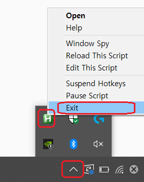

# Turkish Typer
**Download: https://github.com/Sonnykimee/TurkishTyper/releases/**

**Source Code: https://github.com/Sonnykimee/TurkishTyper/blob/main/turkish_double.ahk**

Typing in a Turkish using a US keyboard can be tricky because Turkish alphabets contain diacritic letters that are not on the US keyboard layout. Using Turkish keyboard extension solves this problem, however one difficulty I found is that it changes the overall layout of the keyboard and now you have to manually find out which one is which. So I wrote a simple script that allows you to type diacritic letters by quickly pressing the same key twice. For example, quickly pressing on "u" twice will type "ü".

Transformation chart: 
İ, i -> I, ı 
O, o -> Ö, ö 
U, u -> Ü, ü 
C, c -> Ç, ç 
S, s -> Ş, ş 
G, g -> Ğ, ğ 

**This is probably not perfect and I expect there will be some glitches.**

**Install Guide:**
Download `turkish_double.exe`.

If you see a blue screen that says Windows Smart Defender SmartScreen, click on **More info** and click **Run anyway**. Next time, you can simply double-click on the downloaded `turkish_double.exe` to start the program.

To close the program, go to the right corner of your taskbar, and click on **show hidden icons** that look like ^. There should be a green H icon. Right-click on it, then click on **Exit**.

**Note:** 
I release my script under the public domain which means you are free to do whatever you want to do with it. So feel free to change and share.

However, [AutoHotKey](https://www.autohotkey.com/) v1.1 which my script is complied with is a free/open-source software licensed under [GNU GPLv2](https://www.gnu.org/licenses/old-licenses/gpl-2.0.en.html). GPLv2 allows you to freely use, study, modify the program, and distribute the original and the modified version as you wish. But in extra, GPLv2 also requires that any software that uses GPL software must contain the source code. Therefore turkish_double.exe file that was compiled with AutoHotKey is also under GPLv2. So when you are sharing the `turkish_double.exe` file with someone, please let them know that the original source code is available here on this page (https://github.com/Sonnykimee/TurkishTyper). You don't have to do anything When you are sharing `turkish_double.ahk` file because the AHK file is just a simple text file that does not contain any of AutoHotKey.

Summary: When you are sharing `turkish_double.exe` with someone, please let them know that the original source code is available here on this page (https://github.com/Sonnykimee/TurkishTyper). Thank you!
